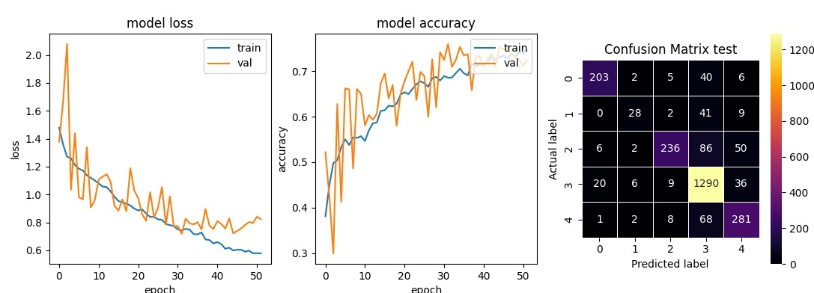
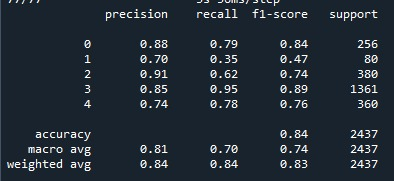

# ECG Pathology Classifier
> Utilizes a CNN model to classify heart conditions in 5 categories using a 12-lead ECG

A model created to be the base of my final paper at college. It utilizes PTB-XL database (Wagner et al., 2022, available at: https://physionet.org/content/ptb-xl/1.0.3/) as training and testing of the model.
The database is made of almost 22.000 ECG exams, each one being represented by 10 second recordings of each one of the 12 leads of an ECG (I, II, III, AVL, AVR, AVF, V1, V2, V3, V4, V5, V6 respectively).
The CNN model used is based on examples of timeseries classifications from keras.

## Development setup

To use the algorithm:
- Download the repsitory available at: https://physionet.org/content/ptb-xl/1.0.3/;
- Unzip the PTB-XL archive to the same folder the .py file is located:
- Install the following dependencies/libraries if not installed on your framework:

```sh
pandas
wfdb
numpy
ast
matplotlib
tensorflow
scykit-learn
seaborn
imblearn
```

## Aproaches to the problem

the 100hz raw 12-lead ECG was preprocessed to eliminate signals with more than one classification, and the labels for the classes were substituted by integers. The signal was read and both the signal and the calsses were converted to arrays.

### CNN-1D

The imput for the model is directly the array from the 12-lead ECG and the best model can be seen by loading the model and using the function:

```sh
model.sumarize()
```

### Ensemble

the same architecture from the CNN-1D model was used, but this time the input for the model is only one lead at the time and when all of them were trained then a voting is started and the most voted condition is atributed to the signal and evaluated.

### Resnet-50

To use this architecture an image is needed, to solve this problem, the archive "building atractors.py" was created. With the use of mathematic transformations, an image with a cartesian plane is generated, that contains all the points from an lead are dispersed in a pattern. Every time that a disturbance occurs ind  the ECG the pattern has now points that doesn't match the rest, therefore distinguishing a normal ECG from a pathologic.

12 images, representing the 12 lead were the inputs given to the Resnet-50 for classification.

## Results




## Discussion

The best model had 84% precision and recall across the 5 categories and was achievewd using the CNN-1D model. Diferent architectures of CNN 1D, Resnet-50, and ensemble models were tested. One categorie (Hypertrophy class 1) even with class balancing still seems to have not enough data for training, which meand that further investigation is needed. The model might need more data to train or a different architecture to work better.

## Release History

 0.0.1
     Work in progress, soon a version utillizing Resnet-50 will be posted as well

0.0.2 
     Work in progress, New version with ensemble and Resnet-50 models

## Meta

Thomas Sponchiado Pastore – [@ThomasSPastore](https://twitter.com/ThomasSPastore) – thomas.spastore@gmail.com

Distributed under the MIT license. See ``LICENSE`` for more information.

[https://github.com/thom01s?tab=repositories](https://github.com//thom01s?tab=repositories])

## Contributing

1. Fork it (<https://github.com/thom01s/Heart-pathology-classification/fork>)
2. Create your feature branch
3. Commit your changes
4. Push to the branch
5. Create a new Pull Request

<!-- Markdown link & img dfn's -->
[npm-image]: https://img.shields.io/npm/v/datadog-metrics.svg?style=flat-square
[npm-url]: https://npmjs.org/package/datadog-metrics
[npm-downloads]: https://img.shields.io/npm/dm/datadog-metrics.svg?style=flat-square
[travis-image]: https://img.shields.io/travis/dbader/node-datadog-metrics/master.svg?style=flat-square
[travis-url]: https://travis-ci.org/dbader/node-datadog-metrics
[wiki]: https://github.com/yourname/yourproject/wiki
